# AI Customer Support Ticket Automation

An end-to-end AI-assisted customer support workflow built with **n8n, Gmail, Groq, PostgreSQL, Slack, JavaScript, and Docker**.

The workflow receives customer support emails from Gmail, normalizes the message, detects duplicate submissions, classifies the ticket with an LLM, validates the structured AI output, creates and assigns a support ticket, escalates high/critical tickets to Slack, drafts a customer response, requires human approval, sends the approved reply through Gmail, and records the ticket lifecycle in an audit trail.


## What It Demonstrates

- Gmail-triggered ticket intake
- Full email body extraction and normalization
- Duplicate ticket detection using Gmail message ID or repeated customer/subject/message content within a 24-hour window
- LLM-based ticket classification
- Structured AI output validation
- Automatic support-team assignment
- High/Critical Slack escalation
- AI-assisted response drafting
- Human-in-the-loop approval before external communication
- PostgreSQL persistence for tickets and responses
- Ticket lifecycle audit logging
- Workflow failure logging and Slack alerting

## Architecture

The workflow has separate intake, AI, deterministic routing, communication, audit, and error-handling stages.

```text
Gmail Trigger
     ↓
Extract Gmail Content
     ↓
Set Content
     ↓
Check Duplicate
     ↓
Duplicate?
  ├─ Yes → Stop
  └─ No
       ↓
   AI Classification
       ↓
   Parse AI Output
       ↓
   Validate AI Output
       ↓
   Create Ticket
       ↓
   Log Ticket Created
       ↓
   Prepare Assignment
       ↓
   Update Ticket Assignment
       ↓
   Log Ticket Assigned
       ↓
   High/Critical?
      ├─ Yes → Slack → Log High/Critical Alert ─┐
      └─ No ─────────────────────────────────────┤
                                                  ↓
                                          AI Response Draft
                                                  ↓
                                          Save Response Draft
                                                  ↓
                                          Log Response Drafted
                                                  ↓
                                          Set Pending Approval
                                                  ↓
                                          Log Approval Requested
                                                  ↓
                                          Human Approval
                                             ├─ Approve
                                             │    ↓
                                             │  Log Approved
                                             │    ↓
                                             │  Send Customer Reply
                                             │    ↓
                                             │  Mark Ticket Sent
                                             │    ↓
                                             │  Log Reply Sent
                                             │
                                             └─ Reject
                                                  ↓
                                               Log Rejected
                                                  ↓
                                               Reopen Ticket
                                                  ↓
                                               Log Reopened
```

### Workflow Architecture

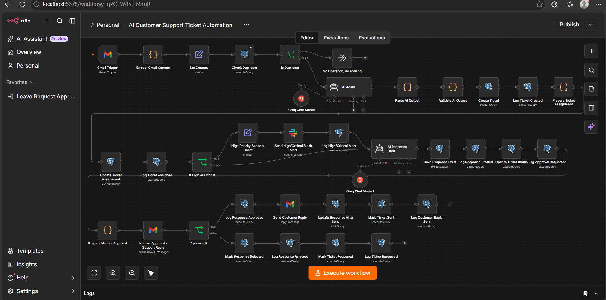

The architecture screenshot shows the overall n8n design, including Gmail intake, duplicate prevention, AI processing, routing, human approval, response sending, and lifecycle logging.

### Full Successful Execution View

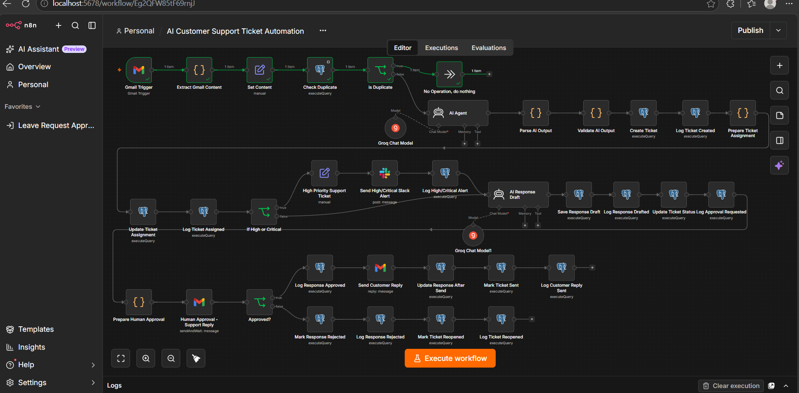

This view captures the workflow with an executed path, complementing the architecture screenshot above.

A separate n8n **Error Trigger** workflow records execution failures in PostgreSQL and sends a Slack notification.

## AI Classification

The classification stage returns structured JSON with:

```json
{
  "category": "billing",
  "priority": "high",
  "sentiment": "negative",
  "summary": "Short summary of the customer's issue.",
  "suggested_action": "Recommended support action.",
  "requires_human": true,
  "spam": false
}
```

Supported categories:

- technical
- billing
- account
- order
- refund
- general
- spam

Supported priorities:

- low
- medium
- high
- critical

Supported sentiments:

- positive
- neutral
- negative

The AI output is validated before the ticket is persisted.

### Classification and Validation Evidence

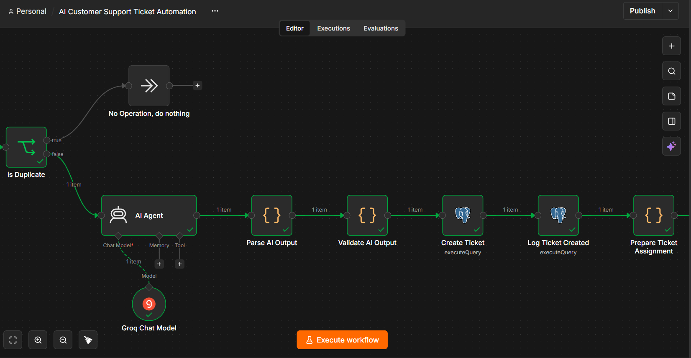

This focused view shows the LLM classification stage followed by JSON parsing, validation, and ticket creation.

## Team Assignment and Priority Routing

After AI classification, the workflow deterministically maps the ticket category to a support team. High and critical tickets take a separate escalation path.

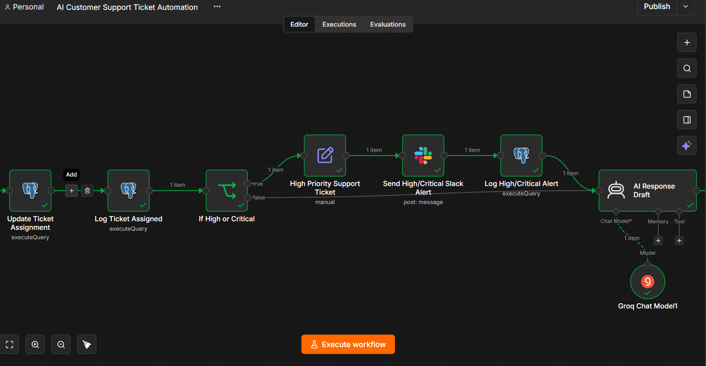

The high/critical branch sends an alert to Slack and records the alert in the audit table.

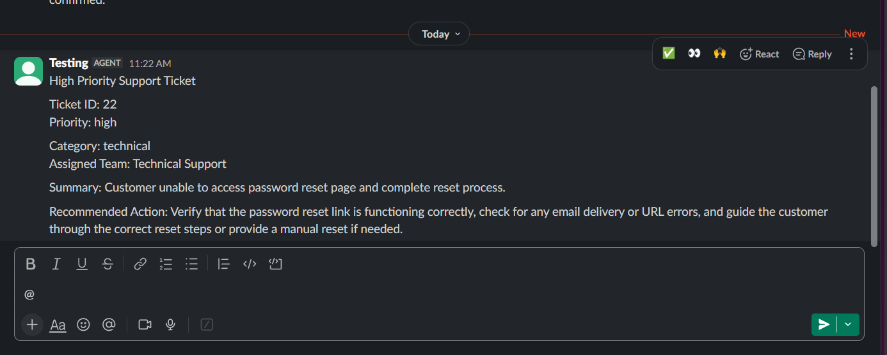

The captured Slack message shows an actual high-priority ticket routed to the appropriate team with its summary and recommended action.

## Human-in-the-Loop Design

The AI is used for classification and response drafting. It does **not** independently send the customer response.

Every generated response goes through a human approval step:

```text
Approve → Send customer reply → Mark ticket sent
Reject  → Mark response rejected → Reopen ticket
```

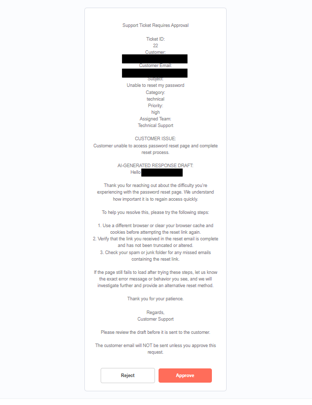

The approval request includes the ticket context and the AI-generated response draft, with explicit Approve and Reject actions.

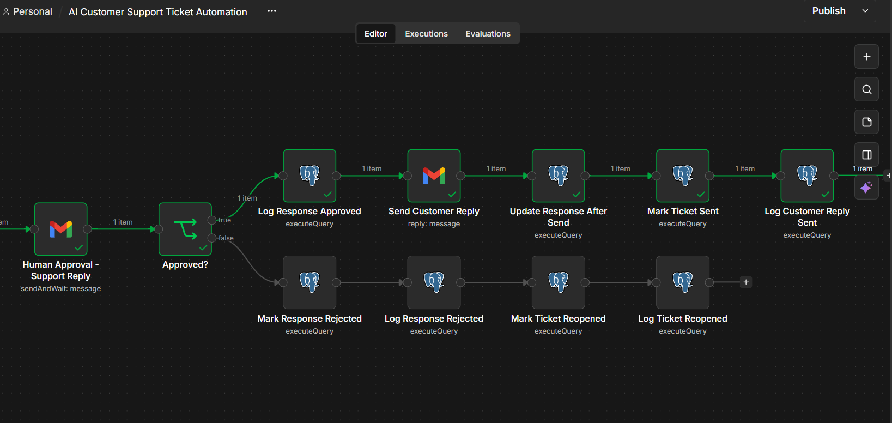

The response-drafting rules also prevent the model from inventing order details, tracking information, refund amounts, delivery dates, account details, or completed actions.

## Duplicate Detection

The workflow first checks the Gmail message ID. It also checks for recent repeated submissions using:

```text
Customer email
+ Subject
+ Message body
+ 24-hour window
```

This prevents repeated submissions from creating a second support ticket while still allowing the same customer to create a similar issue later.

### Duplicate Routing

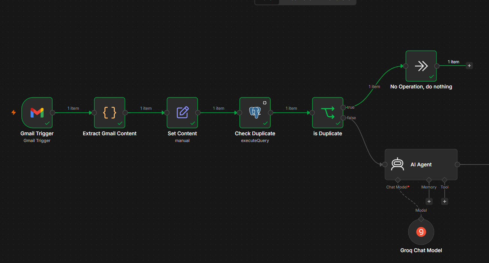

The duplicate branch routes `duplicate = true` to the no-op path rather than continuing to AI classification and ticket creation.

### Actual Duplicate Detection Result

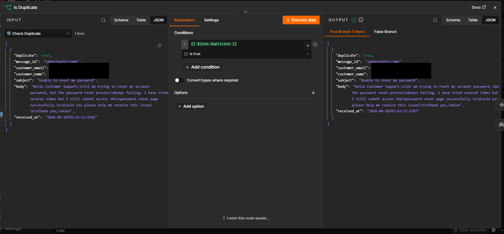

This execution screenshot shows the duplicate check returning `duplicate: true` for a repeated ticket.

## Audit Logging

The `ticket_events` table records important lifecycle events:

```text
ticket_created
ticket_assigned
high_priority_alert_sent
response_drafted
approval_requested
response_approved
response_rejected
customer_reply_sent
ticket_reopened
```

Each event stores a ticket ID, event type, structured event data, and timestamp.

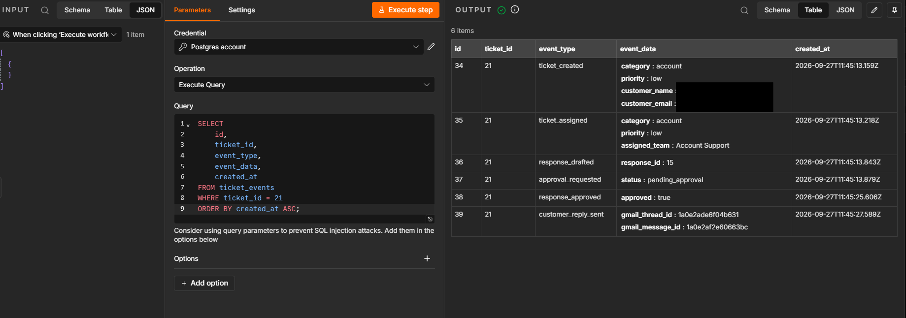

The audit query result shows a complete successful lifecycle for ticket #21, from creation through customer reply.

## Error Handling

A separate Error Trigger workflow captures failed executions and stores:

- workflow name
- workflow ID
- execution ID
- failed node
- error message
- execution URL
- timestamp

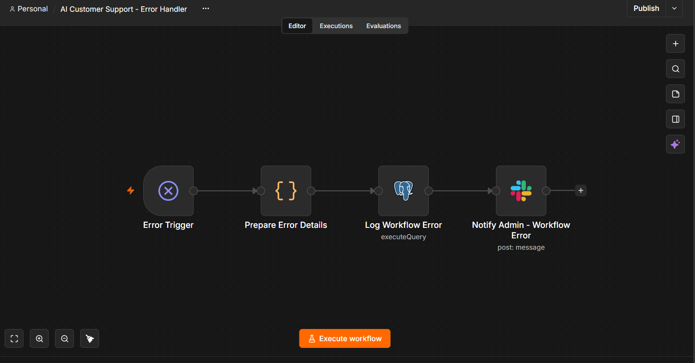

A controlled PostgreSQL failure was tested successfully. The failure was recorded in PostgreSQL and a Slack alert was generated.

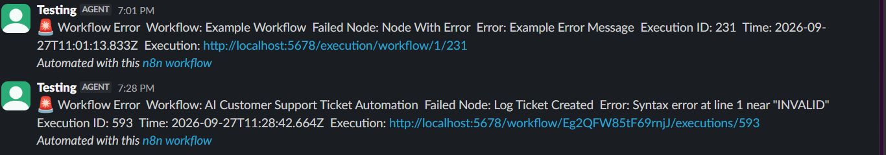

The captured notification shows the real failed workflow, failed node, PostgreSQL error, execution ID, and execution reference.

## Database

### `tickets`

Stores current ticket state, classification, assignment, and status.

### `ticket_responses`

Stores AI response drafts, approval state, final response, and send timestamps.

### `ticket_events`

Stores the chronological ticket audit trail.

### `workflow_errors`

Stores workflow execution failures.

See [docs/DATABASE-SCHEMA.md](docs/DATABASE-SCHEMA.md) for the fields used by the project.

## Testing

The workflow was tested across normal, high-priority, rejection, duplicate, and failure scenarios.

| Test | Result |
|---|---|
| Gmail ticket intake | Passed |
| Full email extraction | Passed |
| Duplicate detection | Passed |
| AI classification | Passed |
| AI output validation | Passed |
| Ticket creation | Passed |
| Automatic team assignment | Passed |
| High/Critical routing | Passed |
| Slack escalation | Passed |
| Low/Medium routing | Passed |
| AI response drafting | Passed |
| Human approval | Passed |
| Approved customer reply | Passed |
| Rejection → reopen | Passed |
| Audit logging | Passed |
| Workflow error logging | Passed |
| Workflow error → Slack | Passed |

See [docs/TEST-RESULTS.md](docs/TEST-RESULTS.md) for concrete test evidence.

## Technology Stack

- **n8n** — workflow orchestration
- **Gmail** — ticket intake, approval, and customer communication
- **Groq** — LLM inference
- **PostgreSQL** — ticket, response, audit, and error persistence
- **Slack** — escalation and failure notifications
- **JavaScript** — normalization, validation, routing, and preparation
- **Docker** — local/self-hosted runtime

## Engineering Practices

- Parameterized SQL queries
- Structured AI output
- Explicit AI validation
- Duplicate prevention
- Human approval before customer communication
- Separate ticket, response, audit, and error data
- Direct references to stable workflow data when downstream nodes change `$json`
- Failure logging and notification
- Test-driven workflow verification using actual execution results

## Portfolio Evidence Map

| Area | Screenshot |
|---|---|
| Architecture | [01](screenshots/01-full-workflow-architecture.png) |
| Successful execution | [02](screenshots/02-full-workflow-successful-execution.png) |
| AI classification and validation | [03](screenshots/03-ai-classification-validation.png) |
| Team assignment / priority routing | [04](screenshots/04-priority-routing.png) |
| High-priority Slack escalation | [05](screenshots/05-slack-high-priority-alert.png) |
| Human approval | [06](screenshots/06-human-approval-email.png) |
| Approval / rejection logic | [07](screenshots/07-approval-rejection-flow.png) |
| PostgreSQL audit trail | [08](screenshots/08-postgresql-audit-trail.png) |
| Duplicate routing | [09](screenshots/09-duplicate-detection-routing.png) |
| Duplicate result | [10](screenshots/10-duplicate-detection-result.png) |
| Error workflow | [11](screenshots/11-error-handler-workflow.png) |
| Real error notification | [12](screenshots/12-error-slack-notification.png) |

## Public Repository Checklist

Before publishing the repository publicly:

- Redact personal names and email addresses visible in test screenshots.
- Do not commit API keys, OAuth client secrets, passwords, database credentials, or access tokens.
- Keep screenshots that demonstrate real execution behavior, not just configuration.
- Keep test data clearly labeled as test/demo data.

## Further Documentation

- [Database Schema](docs/DATABASE-SCHEMA.md)
- [Test Results](docs/TEST-RESULTS.md)
- [Portfolio Case Study](docs/PORTFOLIO-CASE-STUDY.md)
